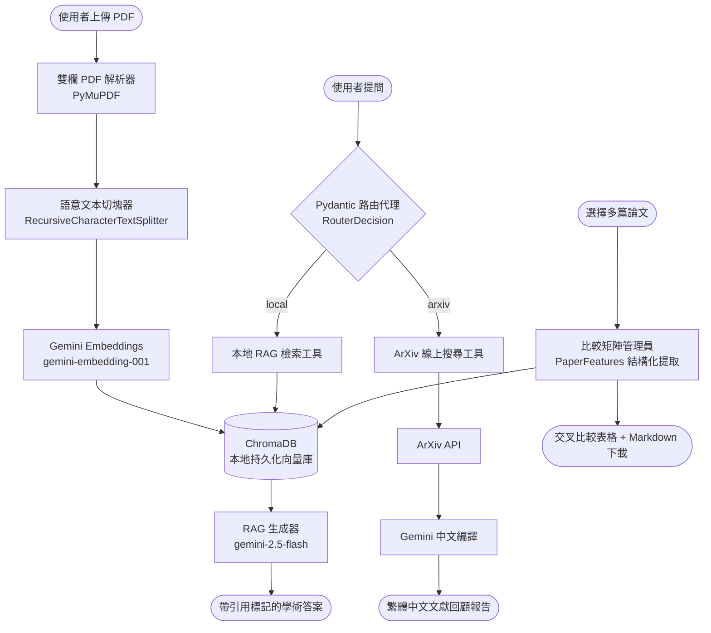

# 📚 Literature Reviewer — 學術論文文獻回顧自動生成器

> **代理型檢索增強生成系統 (Agentic RAG System)**
> 大二資工系期末專題 — 基於 Google Gemini 2.5-Flash 與雙欄排版還原的學術文獻 RAG 系統

---

## 📋 專案簡介

**Literature Reviewer** 是一套端到端的學術論文分析系統，使用者只需上傳多篇學術 PDF，系統便能自動完成：

1. **雙欄排版還原**：精確處理學術論文常見的雙欄 (Double-column) 排版，避免文字閱讀順序錯亂。
2. **語意切塊與向量化**：將論文拆分為語意連貫的文本切塊，並使用 Google Gemini Embeddings 轉為高維語意向量，持久化儲存於本地 ChromaDB。
3. **AI 學術問答與精確引用**：以 RAG (檢索增強生成) 技術，根據檢索到的原始文獻段落生成學術分析，每句關鍵結論皆附帶精確的引用標記，如 `[論文名.pdf, p.5]`。
4. **智慧路由代理 (Router Agent)**：AI 自動分析使用者提問的語意，決定路由至「本地文獻庫 (RAG)」或「外接 ArXiv 線上學術庫 (API)」，並在網頁上完整展示其思考歷程與決策原因。
5. **跨文獻比較矩陣 (Comparison Grid)**：自動從多篇論文中提煉核心方法、實驗資料集、優缺點，生成結構化的交叉比較表格，支援一鍵下載為 Markdown 報告。

---

## 🛠️ 技術堆疊 (Tech Stack)

| 分類 | 技術 | 說明 |
|:---|:---|:---|
| 核心語言 | `Python 3.11` | 專案指定版本 |
| 套件管理 | `uv` | 極速 Python 套件管理器，取代 pip/pipenv |
| LLM 框架 | `LangChain` | 模組化的 LLM 應用開發框架 |
| 模型 API | `Google Gemini API` | 使用 `gemini-2.5-flash`（生成）與 `gemini-embedding-001`（嵌入） |
| LLM 整合 | `langchain-google-genai` | LangChain 與 Gemini 的官方整合套件 |
| 結構化驗證 | `Pydantic v2` | 用於 LLM `with_structured_output` 結構化路由與特徵提取 |
| PDF 解析 | `PyMuPDF (fitz)` | 處理複雜雙欄排版與提取頁碼 Metadata |
| 向量資料庫 | `ChromaDB` | 輕量級本地持久化向量資料庫 |
| 外接搜尋 | `arxiv` Python 套件 | 即時檢索 ArXiv 最新學術論文 |
| 使用者介面 | `Streamlit` | 快速建構美觀且互動性佳的 Web UI |

---

## 📂 專案目錄結構

```text
nlp_final_project/
├── app.py                      # Streamlit 主應用程式進入點 (4 大標籤分頁)
├── pyproject.toml              # uv 專案設定與依賴清單
├── uv.lock                     # uv 依賴鎖定檔（自動產生，勿手動修改）
├── .python-version             # Python 版本標記 (3.11)
├── .env.example                # 環境變數範本（複製為 .env 後填入 API Key）
├── .gitignore                  # Git 忽略設定
├── AGENTS.md                   # AI 技術導師行為指導手冊
├── README.md                   # 本說明文件
├── data/                       # 存放使用者上傳的原始 PDF 論文（Git 忽略）
├── docs/                       # 存放生成的報告與設計文件
├── vectorstore/                # ChromaDB 持久化向量庫目錄（Git 忽略）
│
├── src/                        # 核心原始碼目錄
│   ├── loaders/
│   │   └── pdf_parser.py       # 雙欄排版 PDF 解析器 (DoubleColumnPDFParser)
│   ├── rag/
│   │   ├── text_splitter.py    # 學術文本切塊器 (AcademicTextSplitter)
│   │   ├── vector_manager.py   # 向量資料庫管理員 (AcademicVectorManager)
│   │   ├── generator.py        # RAG 問答生成器 (AcademicRAGGenerator)
│   │   └── comparison_manager.py # 跨文獻比較矩陣管理員 (AcademicComparisonManager)
│   ├── agents/
│   │   └── router_agent.py     # Pydantic 結構化路由代理 (AcademicRouterAgent)
│   ├── tools/
│   │   ├── local_search_tool.py  # 本地 RAG 檢索工具 (LocalSearchTool)
│   │   └── arxiv_search_tool.py  # ArXiv 線上搜尋工具 (ArXivSearchTool)
│   ├── prompts/
│   │   └── academic_prompts.py   # 學術 QA 與引用追蹤 Prompt 範本
│   ├── config/                   # 全域變數與模型路徑配置
│   └── utils/                    # 日誌記錄與輔助工具
│
└── tests/                      # 單元測試與功能驗證腳本
    ├── test_pdf_parser.py      # 雙欄解析測試
    ├── test_pipeline.py        # 解析 + 切塊管線整合測試
    ├── test_vectorstore.py     # 向量庫寫入與語意搜尋測試
    ├── test_rag.py             # RAG 問答生成測試
    ├── test_agent.py           # 路由代理決策測試
    └── test_comparison.py      # 跨文獻比較矩陣測試
```

---

## 🚀 快速開始 (Setup & Installation)

### 前置需求

- **Python 3.11** 已安裝
- **uv** 套件管理器已安裝（[安裝指南](https://docs.astral.sh/uv/getting-started/installation/)）
- **Google Gemini API Key**（免費取得：[Google AI Studio](https://aistudio.google.com/apikey)）

### Step 1：Clone 專案

```bash
git clone <your-repo-url>
cd nlp_final_project
```

### Step 2：安裝 uv（若尚未安裝）

```bash
# Windows (PowerShell)
powershell -ExecutionPolicy ByPass -c "irm https://astral.sh/uv/install.ps1 | iex"

# macOS / Linux
curl -LsSf https://astral.sh/uv/install.sh | sh
```

### Step 3：同步虛擬環境與安裝依賴

```bash
# uv 會自動建立 .venv 虛擬環境並安裝所有 pyproject.toml 中的依賴套件
uv sync
```

> 💡 此指令會根據 `uv.lock` 精確還原所有套件版本，確保團隊成員的環境完全一致。

### Step 4：設定 Gemini API Key

```bash
# 複製環境變數範本
# Windows (PowerShell)
Copy-Item .env.example .env

# macOS / Linux
cp .env.example .env
```

接著用任意文字編輯器開啟 `.env`，將 `your_gemini_api_key_here` 替換為您在 [Google AI Studio](https://aistudio.google.com/apikey) 取得的實際 API Key：

```env
GEMINI_API_KEY=AIzaSy...你的實際金鑰...
```

> ⚠️ **重要**：`.env` 檔案已被 `.gitignore` 排除，**不會被推送到 Git**，您的金鑰是安全的。

### Step 5：建立必要的資料夾

```bash
# Windows (PowerShell)
New-Item -ItemType Directory -Force -Path data, docs, vectorstore

# macOS / Linux
mkdir -p data docs vectorstore
```

### Step 6：啟動 Web 應用

```bash
uv run streamlit run app.py
```

Streamlit 會自動在瀏覽器開啟 `http://localhost:8501`，即可開始使用！

---

## 📖 使用指南

### 📥 Tab 1：論文上傳與存檔

1. 將學術 PDF 論文（支援雙欄排版）拖曳至上傳區。
2. 系統會自動將檔案安全存入 `data/` 資料夾。
3. 前往左側控制台，點擊 **「🔄 向量化本地文獻庫」** 將論文轉換為語意向量。

### 🔍 Tab 2：語意檢索與召回測試

- 輸入學術問題（例如 `What is Multi-Head Attention?`）。
- 系統會在高維語意空間中搜尋最相似的文本切塊。
- 以 Glassmorphic 卡片展示召回結果的 L2 距離、原始檔名與頁碼。

### 💬 Tab 3：AI 文獻問答與學術代理

- **本地 RAG 模式**：直接根據已上傳的本地文獻進行問答，答案附帶句子級引用標記。
- **AI 路由代理模式**（勾選開關）：AI 會自主決策路由至本地 RAG 或 ArXiv 線上搜尋，並展示完整的思考歷程面板。

### 📊 Tab 4：跨文獻比較矩陣

1. 選擇至少兩篇已向量化的論文。
2. 點擊 **「📊 啟動跨文獻特徵提取與矩陣生成」**。
3. 系統會使用 Pydantic 結構化提取，自動生成核心方法、資料集、優缺點的對照表格。
4. 點擊 **「📥 下載 Markdown 表格檔案」** 即可匯出為學術報告格式。

---

## 🔬 單元測試

所有測試腳本位於 `tests/` 目錄下，可使用以下指令逐一執行：

```bash
# 雙欄 PDF 解析測試
uv run python tests/test_pdf_parser.py

# 解析 + 切塊管線整合測試
uv run python tests/test_pipeline.py

# 向量庫寫入與語意搜尋測試
uv run python tests/test_vectorstore.py

# RAG 問答生成測試
uv run python tests/test_rag.py

# 路由代理決策測試
uv run python tests/test_agent.py

# 跨文獻比較矩陣測試
uv run python tests/test_comparison.py
```

> 💡 **注意**：除了 `test_pdf_parser.py` 外，其餘測試皆需要有效的 `GEMINI_API_KEY` 及 `data/` 中的測試用 PDF 文件。

---

## ⚠️ API 使用限制 (Rate Limits)

本專案使用 Google Gemini API **免費方案 (Free Tier)**，有以下速率限制：

| 模型 | 限制 | 說明 |
|:---|:---|:---|
| `gemini-2.5-flash` | 20 RPM | 每分鐘最多 20 次生成請求 |
| `gemini-embedding-001` | 1,500 RPM | 每分鐘最多 1,500 次嵌入請求 |

### 應對策略

- 系統已使用 `@st.cache_resource` 快取所有重型元件，避免 Streamlit 重跑時重複初始化。
- 每次問答操作之間建議**間隔 5–10 秒**，讓配額自動恢復。
- 若遇到 `429 RESOURCE_EXHAUSTED` 錯誤，請等待約 **30–60 秒** 後重試。
- 如需更高配額，可至 [Google AI Studio](https://aistudio.google.com/) 升級為付費方案。

---

## 🏗️ 系統架構流程圖



---

## 📝 開發時程 (Development Roadmap)

| 週次 | 主題 | 狀態 |
|:---:|:---|:---:|
| Week 1 | 基礎建設 (uv 環境、Streamlit UI、多 PDF 上傳) | ✅ 完成 |
| Week 2 | 解析管線 (雙欄排版還原、文本切塊) | ✅ 完成 |
| Week 3 | 向量化與儲存 (Gemini Embeddings、ChromaDB) | ✅ 完成 |
| Week 4 | RAG 管線 (問答生成、引用標記追蹤) | ✅ 完成 |
| Week 5 | 代理與工具 (Pydantic 路由、ArXiv 搜尋) | ✅ 完成 |
| Week 6 | 評估與整合 (比較矩陣、系統打磨) | ✅ 完成 |

---

## 📄 授權 (License)

本專案為大二資工系期末專題作品，僅供學術與教學用途。

---

## 👥 團隊

大二資工系專題小組 — 在 AI 技術導師的引導下，以 Step-by-Step Vibe Coding 模式完成開發。
