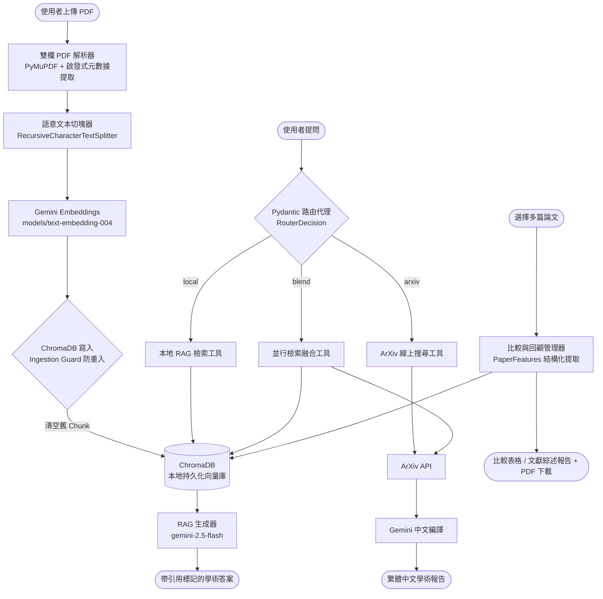

# 📚 Literature Reviewer — 學術論文文獻回顧自動生成器

> **代理型檢索增強生成系統 (Agentic RAG System)**
> 大二資工系期末專題 — 基於 Google Gemini 2.5-Flash 與雙欄排版還原的學術文獻 RAG 系統

[](https://nlpfinalproject.streamlit.app/)

**🌐 雲端線上演示版：** [https://nlpfinalproject.streamlit.app/](https://nlpfinalproject.streamlit.app/)
*(進入網頁後，於側邊欄「專案控制台」手動輸入您的 Gemini API Key 即可立刻開始體驗)*

---

## 📋 專案簡介

**Literature Reviewer** 是一套端到端的學術論文分析系統，使用者只需上傳多篇學術 PDF，系統便能自動完成：

1. **雙欄排版還原**：精確處理學術論文常見的雙欄 (Double-column) 排版，避免文字閱讀順序錯亂。
2. **啟發式元數據提取**：在 PDF 上傳時，自動識別並提取論文的 **標題 (Title)、作者 (Author) 及 摘要 (Abstract)**，將其整合至 Chunk Metadata 中。
3. **語意切塊與向量化**：將論文拆分為語意連貫的文本切塊，並使用 Google Gemini 的 `models/text-embedding-004` 轉為 3072 維語意向量，持久化儲存於本地 ChromaDB。
4. **AI 學術問答與精確引用**：以 RAG (檢索增強生成) 技術，根據檢索到的原始文獻段落生成學術分析，每句關鍵結論皆附帶精確的引用標記，如 `[論文名.pdf, p.5]`。
5. **智慧路由代理 (Router Agent)**：AI 自動分析使用者提問的語意，決定路由至「本地文獻庫 (RAG)」、「外接 ArXiv 線上學術庫 (API)」，或是「混合檢索融合 (Blended Search)」，並在網頁上完整展示其思考歷程與決策原因。
6. **跨文獻比較矩陣 (Comparison Grid)**：自動從多篇論文中提煉核心方法、實驗資料集、優缺點，生成結構化的交叉比較表格，支援一鍵下載為 A4 PDF 報告。
7. **多文獻學術綜述與研究回顧報告 (Literature Review)**：針對多篇已向量化的論文進行交叉比對，生成結構化且具引用標記的繁體中文「文獻回顧報告」，並支援一鍵匯出為標準 A4 格式 PDF。

---

## 🛠️ 技術堆疊 (Tech Stack)

| 分類 | 技術 | 說明 |
|:---|:---|:---|
| 核心語言 | `Python 3.11` | 專案指定版本 |
| 套件管理 | `uv` | 極速 Python 套件管理器，取代 pip/pipenv |
| LLM 框架 | `LangChain` | 模組化的 LLM 應用開發框架 |
| 模型 API | `Google Gemini API` | 使用 `gemini-2.5-flash`（生成）與 `models/text-embedding-004`（3072維嵌入） |
| LLM 整合 | `langchain-google-genai` | LangChain 與 Gemini 的官方整合套件 |
| 結構化驗證 | `Pydantic v2` | 用於 LLM `with_structured_output` 結構化路由與特徵提取 |
| PDF 解析 | `PyMuPDF (fitz)` | 處理複雜雙欄排版與提取頁碼 Metadata |
| 向量資料庫 | `ChromaDB` | 輕量級本地持久化向量資料庫，具備 **維度不符自癒重置機制** |
| 外接搜尋 | `arxiv` Python 套件 | 即時檢索 ArXiv 最新學術論文 |
| 使用者介面 | `Streamlit` | 快速建構美觀且互動性佳的 Web UI |

---

## 📂 專案目錄結構

```text
nlp_final_project/
├── app.py                      # Streamlit 主應用程式進入點 (5 大標籤分頁)
├── pyproject.toml              # uv 專案設定與依賴清單
├── uv.lock                     # uv 依賴鎖定檔（自動產生，勿手動修改）
├── .python-version             # Python 版本標記 (3.11)
├── .env.example                # 環境變數範本（複製為 .env 後填入 API Key）
├── .gitignore                  # Git 忽略設定
├── AGENTS.md                   # AI 技術導師行為指導手冊
├── README.md                   # 本說明文件
├── data/                       # 存放使用者上傳的原始 PDF 論文（Git 忽略）
├── docs/                       # 存放生成的報告與設計文件
├── vectorstore/                # ChromaDB 持久化向量庫目錄（Git 忽略）
│
├── src/                        # 核心原始碼目錄
│   ├── __init__.py             # 模組初始化
│   ├── loaders/
│   │   ├── __init__.py
│   │   └── pdf_parser.py       # 雙欄排版 PDF 解析器 (DoubleColumnPDFParser，包含啟發式 Metadata 提取)
│   ├── rag/
│   │   ├── __init__.py
│   │   ├── text_splitter.py    # 學術文本切塊器 (AcademicTextSplitter)
│   │   ├── vector_manager.py   # 向量資料庫管理員 (AcademicVectorManager，支援防重入與自癒機制)
│   │   ├── generator.py        # RAG 問答生成器 (AcademicRAGGenerator)
│   │   ├── comparison_manager.py # 跨文獻比較矩陣管理員 (AcademicComparisonManager)
│   │   └── literature_review_manager.py # 文獻回顧管理器 (AcademicLiteratureReviewGenerator)
│   ├── agents/
│   │   ├── __init__.py
│   │   └── router_agent.py     # Pydantic 結構化路由代理 (AcademicRouterAgent，支援混合路由)
│   ├── tools/
│   │   ├── __init__.py
│   │   ├── local_search_tool.py  # 本地 RAG 檢索工具 (LocalSearchTool)
│   │   └── arxiv_search_tool.py  # ArXiv 線上搜尋工具 (ArXivSearchTool)
│   ├── prompts/
│   │   ├── __init__.py
│   │   └── academic_prompts.py   # 學術 QA 與引用追蹤 Prompt 範本
│   ├── config/
│   │   ├── __init__.py
│   │   └── settings.py         # 全域變數與模型路徑中央化配置
│   ├── ui/
│   │   ├── __init__.py
│   │   └── styles.py           # Streamlit CSS 與 Hero Banner 模組化 UI 樣式
│   └── utils/
│       ├── __init__.py
│       ├── logger.py           # 系統統一日誌記錄器
│       ├── pdf_generator.py    # 免字型依賴繁體中文 PDF 渲染產生器
│       └── retry_handler.py    # 429 API 指數退避重試處理器
│
└── tests/                      # 單元測試與功能驗證腳本
    ├── test_imports.py         # 專案依賴與模組導入驗證測試
    ├── test_pdf_parser.py      # 雙欄解析與元數據提取測試
    ├── test_pipeline.py        # 解析 + 切塊管線整合測試
    ├── test_vectorstore.py     # 向量庫寫入、防重入與自癒測試
    ├── test_rag.py             # RAG 問答生成測試
    ├── test_agent.py           # 路由代理與混合路由決策測試
    └── test_comparison.py      # 跨文獻比較矩陣測試
```

---

## 🚀 快速開始 (Setup & Installation)

### 前置需求

- **Python 3.11** 已安裝
- **uv** 套件管理器已安裝（[安裝指南](https://docs.astral.sh/uv/getting-started/installation/)）
- **Google Gemini API Key**（免費取得：[Google AI Studio](https://aistudio.google.com/apikey)）

### Step 1：Clone 專案

```bash
git clone <your-repo-url>
cd nlp_final_project
```

### Step 2：安裝 uv（若尚未安裝）

```bash
# Windows (PowerShell)
powershell -ExecutionPolicy ByPass -c "irm https://astral.sh/uv/install.ps1 | iex"

# macOS / Linux
curl -LsSf https://astral.sh/uv/install.sh | sh
```

### Step 3：同步虛擬環境與安裝依賴

```bash
# uv 會自動建立 .venv 虛擬環境並安裝所有 pyproject.toml 中的依賴套件
uv sync
```

> 💡 此指令會根據 `uv.lock` 精確還原所有套件版本，確保團隊成員的環境完全一致。

### Step 4：取得 Gemini API Key

本系統已全面重構為「介面端手動輸入金鑰」，因此您不需要在本機配置任何 `.env` 檔案或設定系統環境變數！您只需造訪 [Google AI Studio](https://aistudio.google.com/apikey) 免費申請一個 Gemini API Key，並在啟動 Web UI 後，直接於網頁左側的「專案控制台」中輸入即可啟動服務。這使本系統非常安全且適合線上共享部署。

### Step 5：建立必要的資料夾

```bash
# Windows (PowerShell)
New-Item -ItemType Directory -Force -Path data, docs, vectorstore

# macOS / Linux
mkdir -p data docs vectorstore
```

### Step 6：啟動 Web 應用

```bash
uv run streamlit run app.py
```

Streamlit 會自動在瀏覽器開啟 `http://localhost:8501`，即可開始使用！

---

## 📖 使用指南

### 📥 Tab 1：論文上傳與存檔

1. 將學術 PDF 論文（支援雙欄排版）拖曳至上傳區。
2. 系統會自動解析論文並安全存入 `data/` 資料夾，且**自動啟動啟發式特徵提取**（Title, Author, Abstract）。
3. 前往左側控制台，點擊 **「🔄 向量化本地文獻庫」** 將論文轉換為語意向量（若重複上傳，系統會自動啟動 **Ingestion Guard** 刪除舊向量）。

### 🔍 Tab 2：語意檢索與召回測試

- 輸入學術問題（例如 `What is Multi-Head Attention?`）。
- 系統會在高維語意空間中搜尋最相似的文本切塊。
- 以 Glassmorphic 卡片展示召回結果的 L2 距離、原始檔名、頁碼以及提取之 Metadata。

### 💬 Tab 3：AI 文獻問答與學術代理

- **本地 RAG 模式**：直接根據已上傳的本地文獻進行問答，答案附帶句子級引用標記。
- **AI 路由代理模式**（勾選開關）：AI 會自主決策路由至本地 RAG、ArXiv 線上搜尋，或是 **混合檢索融合 (Blended Search)**（同時並行本地庫與 ArXiv API 並進行生成），展示完整的思考歷程面板。
- **PDF 報告匯出**：可一鍵下載為標準 A4 格式的 PDF 報告檔案（預設下載格式）。

### 📊 Tab 4：跨文獻比較矩陣

1. 選擇至少兩篇已向量化的論文。
2. 點擊 **「📊 啟動跨文獻特徵提取與矩陣生成」**。
3. 系統會使用 Pydantic 結構化提取，自動生成核心方法、資料集、優缺點的對照表格。
4. 點擊 **「📥 下載學術比較報告 (.pdf)」** 即可匯出為標準 A4 PDF 報告。

### 📚 Tab 5：文獻回顧綜述

1. 選擇至少兩篇已向量化的本地論文。
2. 點擊 **「📚 啟動綜述特徵交叉比對與回顧報告生成」**。
3. 系統將交叉比對技術脈絡、共同瓶頸與研究缺口，生成結構化的繁體中文文獻綜述報告。
4. 點擊 **「📥 下載學術綜述報告 (.pdf)」** 一鍵導出為標準 A4 PDF 報告。

---

## 🔬 單元測試與功能驗證

所有測試腳本位於 `tests/` 目錄下，可使用以下指令逐一執行：

```bash
# 專案依賴與模組導入驗證測試 (確保專案重構後導入路徑無誤)
uv run python tests/test_imports.py

# 雙欄 PDF 解析與元數據提取測試
uv run python tests/test_pdf_parser.py

# 解析 + 切塊管線整合測試
uv run python tests/test_pipeline.py

# 向量庫寫入、防重入與自癒測試
uv run python tests/test_vectorstore.py

# RAG 問答生成測試
uv run python tests/test_rag.py

# 路由代理與混合路由決策測試
uv run python tests/test_agent.py

# 跨文獻比較矩陣測試
uv run python tests/test_comparison.py
```

> 💡 **注意**：除了 `test_imports.py` 與 `test_pdf_parser.py` 外，其餘測試皆需要有效的 `GEMINI_API_KEY` 及 `data/` 中的測試用 PDF 文件。

---

## ⚠️ API 使用限制 (Rate Limits)

本專案使用 Google Gemini API **免費方案 (Free Tier)**，有以下速率限制：

| 模型 | 限制 | 說明 |
|:---|:---|:---|
| `gemini-2.5-flash` | 20 RPM | 每分鐘最多 20 次生成請求 |
| `models/text-embedding-004` | 1,500 RPM | 每分鐘最多 1,500 次嵌入請求 |

### 應對策略

- 系統已使用 `@st.cache_resource` 快取所有重型元件，避免 Streamlit 重跑時重複初始化。
- 每次問答操作之間建議**間隔 5–10 秒**，讓配額自動恢復。
- 若遇到 `429 RESOURCE_EXHAUSTED` 錯誤，系統將啟動 **指數退避處理器** 自動重試，並在 Streamlit 前端渲染出倒數黃色警告提示。
- 如需更高配額，可至 [Google AI Studio](https://aistudio.google.com/) 升級為付費方案。

---

## 🏗️ 系統架構流程圖



---

## 📝 開發時程 (Development Roadmap)

| 週次 | 主題 | 狀態 |
|:---:|:---|:---:|
| Week 1 | 基礎建設 (uv 環境、Streamlit UI、多 PDF 上傳) | ✅ 完成 |
| Week 2 | 解析管線 (雙欄排版還原、文本切塊) | ✅ 完成 |
| Week 3 | 向量化與儲存 (Gemini Embeddings、ChromaDB) | ✅ 完成 |
| Week 4 | RAG 管線 (問答生成、引用標記追蹤) | ✅ 完成 |
| Week 5 | 代理與工具 (Pydantic 路由、ArXiv 搜尋) | ✅ 完成 |
| Week 6 | 評估與整合 (比較矩陣、系統打磨、文獻綜述) | ✅ 完成 |

---

## 🌐 雲端線上部署 (Cloud Deployment)

本專案已成功自動化部署於 **Streamlit Community Cloud**！
*   **線上體驗網址**：[https://nlpfinalproject.streamlit.app/](https://nlpfinalproject.streamlit.app/)
*   **使用方式**：造訪網頁後，請在左側側邊欄的控制台輸入您在 Google AI Studio 申請的 `Gemini API Key`（系統採用加密密碼輸入且僅儲存於本機瀏覽器會話中，非常安全），即可開始進行論文上傳、語意相似檢索、多輪問答代理路由與比較矩陣導出。

> 💡 **離線預建置向量庫**：為確保雲端網頁一開啟就能直接進行 Demo，我們在本機預先將 BERT 與 Transformer 等經典論文進行了解析與向量化，並將 `vectorstore/` 的 SQLite 索引目錄直接提交到了 GitHub 中。這使得線上環境擁有「隨開即用」的唯讀向量索引，解決了免費雲端容器重啟後本機資料庫被清空的痛點。

---

## 🌟 最終產品級優化與新增功能

本系統已超越一般的 MVP 原型，完成了八大產品級功能擴充與體驗打磨：

1. **Gemini API 429 限流指數退避重試**：在遭遇免費層 API 的 20 RPM 限制時，自動進行多達 5 次退避重試，並在 Streamlit 前端渲染出倒數黃色警告提示，大幅提升 Demo 期間的系統魯棒性。
2. **狀態感應增量向量化與單篇刪除**：側邊欄論文列表實時比對，以狀態燈號（🟢 已向量化 / ⚪ 未向量化）顯示狀態。支援單篇論文增量寫入與物理/向量刪除，並自動連動更新快取。
3. **多輪對話歷史氣泡 UI**：Tab 3 問答區重構成為對話氣泡 UI，支援多輪追問。結合最近 5 輪對話，使 AI 能精確理解包含代名詞的上下文（例如 "How does it work?" 中的 "it"）。
4. **免字型依賴之繁體中文 A4 PDF 一鍵匯出**：將 Tab 3 QA 問答歷史、Tab 4 比較結果與 Tab 5 文獻綜述一鍵匯出升級為標準 A4 格式 PDF。利用 PyMuPDF 內嵌 CJK 字型 `"china-t"`，雲端部署亦無需上傳任何字型檔且完全不亂碼。
5. **脈動骨架屏加載動畫**：在 Tab 2、Tab 3、Tab 4 與 Tab 5 的長時間 API 等待階段，以閃爍脈動的卡片骨架屏 (Skeleton Screen) 代替單調的 loading 圈圈，大幅提升視覺高質感。
6. **重複文獻防重入與自動覆蓋 (Ingestion Guard)**：重寫 `store_documents`，在寫入新論文前會自動比對並清空 ChromaDB 中舊有的同名 Chunk 向量，保證資料乾淨性。
7. **啟發式學術元數據提取 (Heuristic Metadata Extraction)**：擴充 PyMuPDF 解析管道，利用正則與字體大小啟發式演算法自動提取學術 PDF 的 標題 (Title)、作者 (Author) 及 摘要 (Abstract) 等，並存為 metadata。
8. **向量庫維度不符自癒機制 (Vector Dim Self-Healing)**：在升級嵌入模型至 `models/text-embedding-004` (3072維) 時，若資料庫檢測到既有向量維度不符 (768維)，會自動執行重置與重建，避免系統拋出維度不符異常而崩潰。
9. **代理人混合路由與檢索融合 (Hybrid Routing & Blended Search)**：Routing Agent 支持 `both` 融合決策，並行查本地庫與 ArXiv，融合生成最新的綜述回答。
10. **全域中央配置與日誌重構**：提取全域設定至 `src/config/settings.py`，並建立了統一的 `logger.py` 日誌記錄系統，實踐標準軟體工程規範。

---

## 📄 授權 (License)

本專案為大二資工系期末專題作品，僅供學術與教學用途。

---

## 👥 團隊

大二資工系專題小組 — 在 AI 技術導師的引導下，以 Step-by-Step Vibe Coding 模式完成開發。
